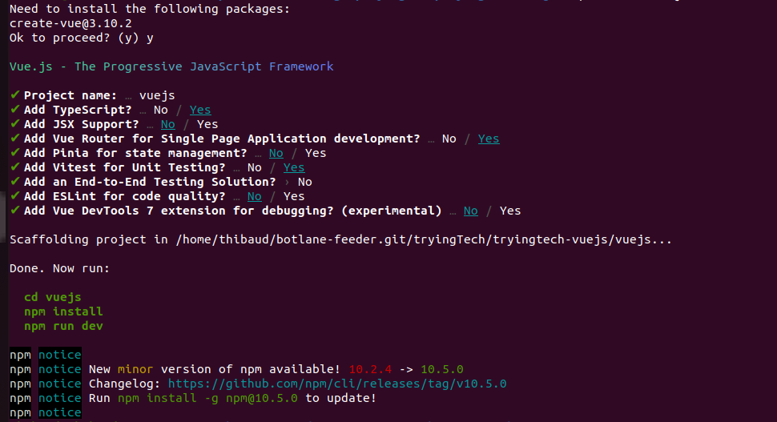

# tryingtech-vuejs

## Initialisation du projet

Dans un premier temps, il faut créer le projet Vue-JS.  
Il y a deux options.
- Soit en installant NPM et Vue sur sa machine. Puis lancer la création du projet par VueJS.
- Soit faire ce processus, on utilisant uniquement un conteneur et en partageant le volume.

L'avantage d'utiliser Docker est l'isolation complète de votre machine, en utilisant que des conteneurs.  
L'inconvénient est la sur-utilisation de Docker et la travail supplémentaire de ne pas utiliser le terminal simplement, mais de créer un script Dockerfile pour le faire.

### Prérequis

- Docker
- NPM
- VueJS

Installation de Docker :  
Il faudra quoiqu'il arrive installer Docker. C'est un effort initial que de l'utiliser, mais cela permettra de gagner beaucoup de temps dans toutes les étapes de mise en production.
Pour cela, le mieux est de passer par le script de Docker que l'on retrouve dans sa propre documentation : 
- [Documentation Docker](https://docs.docker.com/engine/install/ubuntu/)


Installation de NPM :  
La procédure actuelle est d'installer NVM (node version manager), puis d'installer NodeJS (appelé Node), qui installera également NPM
Pour cela, le mieux est de passer par la documentation de NPM :
- [Documentation NPM](https://nodejs.org/en/download/package-manager)

Installation de VueJS :  
L'installation de VueJS, se fait en utilisant l'utilitaire NPM qui installe les dépendences Node
Pour cela, la voix classique de l'utilisation de NPM est le code suivant :
- `npm install vue-router`


### Installation de VueJS et création d'un projet

La création initiale d'un projet VueJS est décrite dans la [documenation officiel de VueJS](https://vuejs.org/guide/quick-start.html).  
On reprendra dans ce ReadMe.md, les différentes étapes importantes à retenir et surtout les liens vers la documentation, afin de comprendre plus en détails.

Je propose dans ce guide, la permière installation d'un projet VueJS avec les options suivantes :


On retiendra les options validées suivantes :
- Add TypeScript? … Yes
- Add Vue Router for Single Page Application development? … Yes
- Add Vitest for Unit Testing? … Yes
- Add an End-to-End Testing Solution? › No
- Add ESLint for code quality? … No / Yes **À voir**
- Add Vue DevTools 7 extension for debugging? (experimental) … No / Yes **À voir**

Afin de créer un environnement initial assez complet, en SPA et avec des tests unitaire.

On est censé trouver une arborescence comme suit :  
└── vuejs  
    ├── env.d.ts  
    ├── index.html  
    ├── package.json  
    ├── public  
    │   └── favicon.ico  
    ├── README.md  
    ├── src  
    │   ├── App.vue  
    │   ├── assets  
    │   │   ├── base.css  
    │   │   ├── logo.svg  
    │   │   └── main.css  
    │   ├── components  
    │   │   ├── HelloWorld.vue  
    │   │   ├── icons  
    │   │   │   ├── IconCommunity.vue  
    │   │   │   ├── IconDocumentation.vue  
    │   │   │   ├── IconEcosystem.vue  
    │   │   │   ├── IconSupport.vue  
    │   │   │   └── IconTooling.vue  
    │   │   ├── __tests__  
    │   │   │   └── HelloWorld.spec.ts  
    │   │   ├── TheWelcome.vue  
    │   │   └── WelcomeItem.vue  
    │   ├── main.ts  
    │   ├── router  
    │   │   └── index.ts  
    │   └── views  
    │       ├── AboutView.vue  
    │       └── HomeView.vue  
    ├── tsconfig.app.json  
    ├── tsconfig.json  
    ├── tsconfig.node.json  
    ├── tsconfig.vitest.json  
    ├── vite.config.ts  
    └── vitest.config.ts  


Comme indiqué par l'installateur VueJS, il ne reste plus qu'à lancer le projet, avec un build et un run.  
Sauf que nous allons vouloir lancer le projet par Docker, afin de commencer la conteneurisation de notre application.  
Cela permettra également de ne pas à avoir en local, tous les fichiers des modules nécessaires à l'utilisation de l'application.  


## La base d'une application VueJS

### Creation d'une application

Parlons de la construction d'une application VueJS.

- Un fichier top level : `src/main.ts` qui contient `createApp`

```js
import { createApp } from 'vue'
const app = createApp(App)
app.use(router)
app.mount('#app')
```

- à partir d'un composant de départ `src/App.vue`

### Un composant VueJS

Qu'est-ce qu'un composant VueJS ?

- script : contient le code JavaScript du composant, y compris les propriétés, les données, les méthodes et d'autres fonctionnalités logiques.
  - et surtout les modeles de données liées aux balises que l'on retrouve dans Template
- template : contient l'HTML du composant, c'est-à-dire la structure de l'interface utilisateur que le composant va afficher.   
- style : contient les styles CSS du composant pour la mise en forme et l'apparence.

Il faut savoir que ces différentes parties sont complétement imperméables aux autres composants de l'application.  
À moins de les importer entre eux.


### Spécificité de VueJS

Ce qu'apporte VueJS c'est un paradigme de développement orienté composants.  
C'est à dire des objets isolés et automones, comme vue plus haut.  
Permettant un développement découpé et donc plus simple et scalable.


Ce que VueJS apporte, ce sont les directices, c'est une gestion du DOM particulière au framework, avec des fonctions dans le template qui simplifie la gestion des composants (et optimise les performances lors du travail ?).

Mais surtout permet de créer un lien bidirectionnel des données à l'affichage : entre le model et la vue : **Le binding**.

Beaucoup d'exemples sont présentés dans le documentation [Template Syntax](https://vuejs.org/guide/essentials/template-syntax.html)

Ce que l'on retiendra pour notre première application c'est : 
- Text Interpolation : cela permet d'afficher un attribut de notre composant dans l'HTML. Il sera mis à jour si celui-ci doit changer.
  - `{{ message }}`
- Attribute Bindings : Cela permet le lier un attribut de n'importe quelle balise HTML, à un attribut de notre composant.
  - `:id="id"`
  - `:title="title"`
  - `:class="classes"`
  - Même de bind un tableau entier d'attribut : 
    - `const objectOfAttrs = { id: 'container', class: 'wrapper' }`
    - `v-bind:objectOfAttrs`
- Directives :
  - une boucle for `v-for="todo in todos"`
  - une confition `v-if="seen"` ainsi que `v-else`
  - un listener `v-on:[eventName]="doSomething"` Ou alors `@[eventName]="doSomething"` ; exemple `@click="myFunction"`

### Bien utilisé les 3 pilier d'un composant

Un template qui ...

Un script qui ...

Un style qui ...

## Tutoriel d'une application simple

***WIP : https://vuejs.org/guide/essentials/class-and-style.html***


## TODO - Avancé

- Voir les functions de rendu & JSX : [doc VueJS](https://vuejs.org/guide/extras/render-function.html)